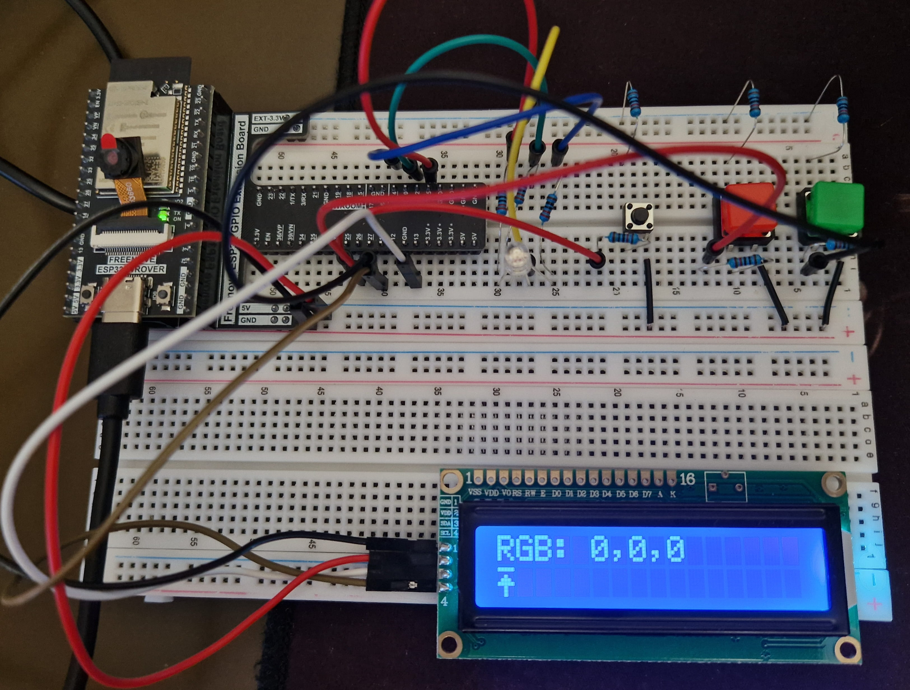
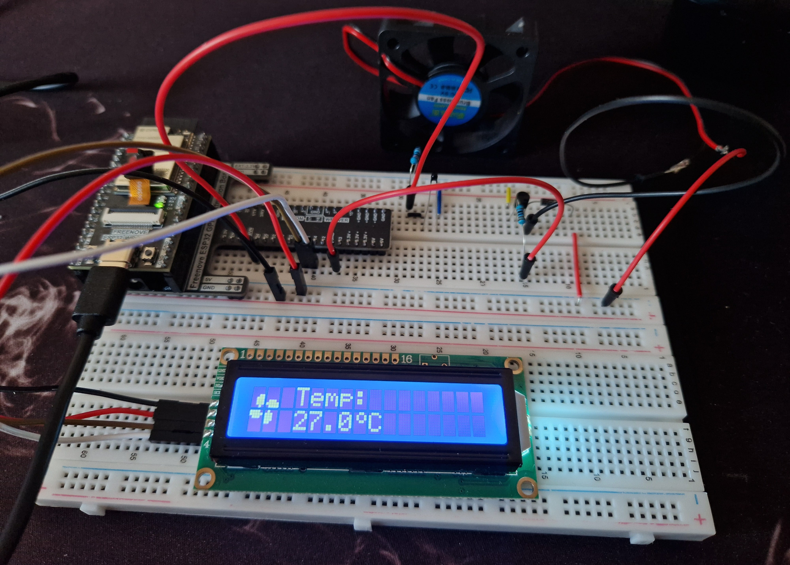
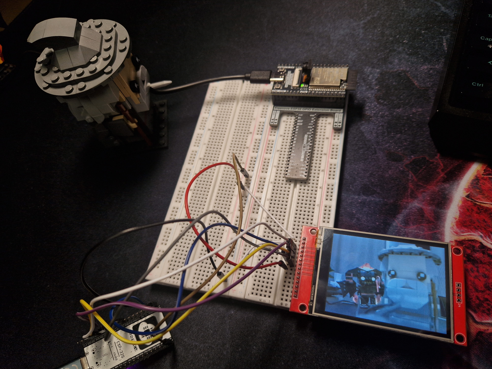
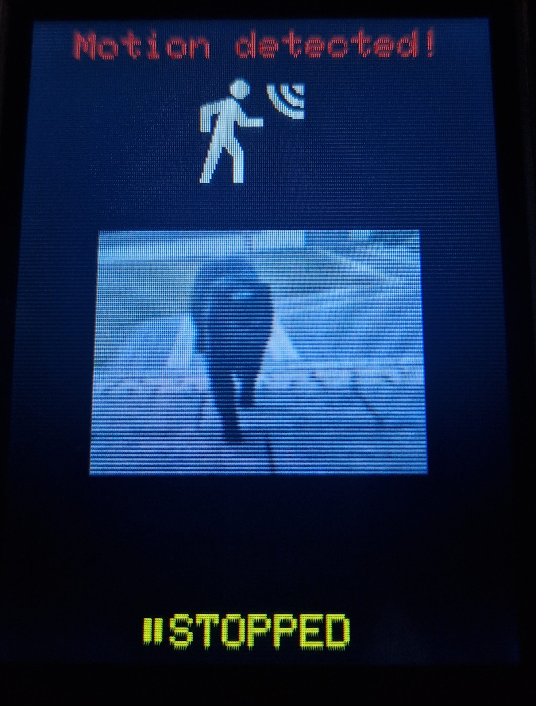
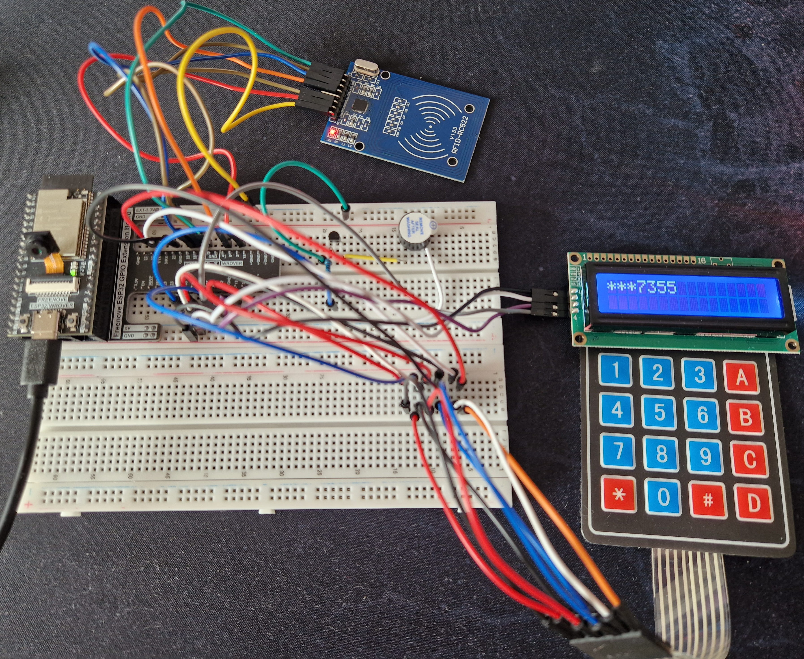
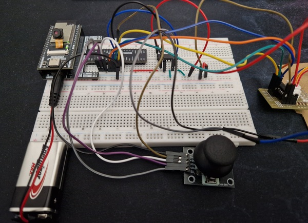
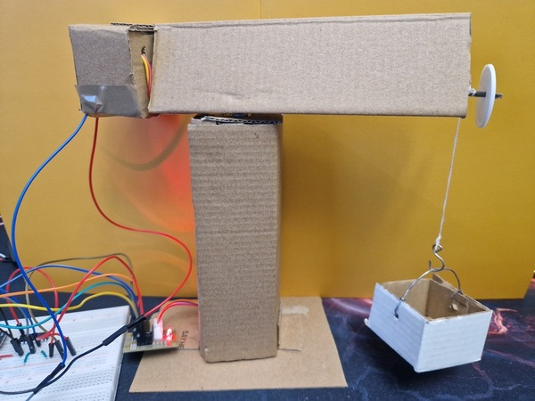

# ESP32 Playground
A collection of my experiments with ESP32.

## Hardware
All projects in this repository are developed using:
- ESP32-WROVER-E
- Freenove ESP32 GPIO Extension Board
- Breadboard 830 tie-points

  

## Projects

### Table of Contents

- [button_toggle_led](#button_toggle_led)
- [potentiometer_led_bar](#potentiometer_led_bar)
- [button_lcd_rgb_control](#button_lcd_rgb_control)
- [buzzer_touch_alarm](#buzzer_touch_alarm)
- [thermistor_fan_control](#thermistor_fan_control)
- [photoresistor_led_bar_lamp](#photoresistor_led_bar_lamp)
- [wifi_clock_temp_humidity_display](#wifi_clock_temp_humidity_display)
- [cam_tft_live_view](#cam_tft_live_view)
- [cam_tft_motion_detection](#cam_tft_motion_detection)
- [rfid_keypad_bomb_simulator](#rfid_keypad_bomb_simulator)
- [crane_joystick_dual_motor_control](#crane_joystick_dual_motor_control)

### button_toggle_led
Basic mechanism of a lamp controlled by a single button. Each time the button is pressed, the lamp (LED) changes its state.

Components required:
- 4 × jumper M/M
- 1 × LED
- 1 × push button
- 1 × resistor 220 Ω (LED)
- 2 × resistor 10 kΩ (push button)

### potentiometer_led_bar
This project implements a simple LED bar indicator controlled by a potentiometer. The ESP32 reads the analog value from the potentiometer and lights up a corresponding number of LEDs.

Components required:
- 13 × jumper M/M
- 1 × 10 segment LED bar graph (or 10 × LED)
- 10 × resistor 220 Ω (LED Bar Graph)
- 1 × potentiometer B10K

### button_lcd_rgb_control
This project implements a simple RGB LED controller. User can select one of the RGB color channels and adjust its brightness using buttons. The current RGB values are displayed on the LCD, and a pointer indicates the selected color channel.

Components required:
- 10 × jumper M/M
- 4 × jumper F/M (LCD)
- 1 × RGB LED
- 1 × LCD1602 Module
- 3 × push button
- 3 × resistor 220 Ω (RGB LED)
- 6 × resistor 10 kΩ (push buttons)

### buzzer_touch_alarm
Simple alarm system triggered by the ESP32 touch sensor. When the sensor is touched, the ESP32 activates an alarm sequence: a buzzer sounds and two LEDs flash alternately.

Components required:
- 9 × jumper M/M
- 2 × LED
- 1 × active buzzer
- 1 × NPN transistor
- 1 × resistor 1 kΩ (transistor)
- 2 × resistor 220 Ω (LEDs)

### thermistor_fan_control
This project implements an automatic cooling system controlled by a thermistor. The ESP32 reads the temperature from a thermistor using an analog input and controls a fan based on predefined temperature thresholds. The current temperature is displayed on an LCD1602 screen using the I2C interface. When the fan is active, an animated fan icon is shown on the display to visually indicate that cooling is in progress. The system also uses hysteresis to prevent rapid switching of the fan around the threshold temperature.

Components required:
- 6 × jumper M/M
- 4 × jumper F/M (LCD)
- 1 × thermistor
- 1 × NPN transistor
- 1 × 5V brushless DC cooling fan
- 1 × LCD1602 Module
- 1 × rectifier diode IN4001
- 1 × resistor 1 kΩ (transistor)
- 1 × resistor 10 kΩ (thermistor)

 

### photoresistor_led_bar_lamp
This project implements a light-responsive lamp system using a photoresistor. The ESP32 reads the ambient light level from the photoresistor using an analog input. Based on the measured light intensity, a WS2812 LED bar displays the current light level using different colors. At the same time, a simple LED lamp (composed of multiple LEDs) adjusts the number of active LEDs according to the light intensity. A push button allows the user to toggle the lamp on or off independently of the sensor readings. Additional indicator LEDs show whether the lamp system is currently enabled or disabled.

Components required:
- 3 × jumper F/M (8 RGB LED Module)
- 18 × jumper M/M
- 1 × photoresistor
- 1 × push button
- 1 × Freenove 8 RGB LED Module
- 7 × LED (lamp + on/off indicators)
- 7 × resistor 220 Ω (LEDs)
- 3 × resistor 10 kΩ (push button + photoresistor)

### wifi_clock_temp_humidity_display
This project implements a simple environmental monitoring display using a TFT screen. The system connects to WiFi and synchronizes the current date and time using an NTP server. The current time and date are displayed on the screen and updated automatically. A DHT11 sensor is used to measure the ambient temperature and humidity. The ESP32 periodically reads the sensor values and displays them on the TFT screen.Depending on the measured values, different icons are shown to visually indicate temperature and humidity conditions. The interface also includes a small animated clock colon and graphical icons, including a cat character that changes its appearance depending on environmental conditions. This provides a simple and visually engaging way to monitor the indoor climate.

   

Components required:
- 12 × jumper M/M
- 1 × TFT LCD 2,8″ display (SPI)
- 1 × DHT11 sensor
- 1 × resistor 10 kΩ (DHT11 sensor)

### cam_tft_live_view
Project implements a simple wireless image streaming system using two ESP32 boards. One ESP32 (with camera module) captures images and serves them over WiFi, while the second ESP32 downloads the image and displays it on a TFT screen in near real-time. The first ESP32 acts as an HTTP server and provides a `/capture` endpoint that returns a JPEG image. The display device periodically requests this image, decodes it using a JPEG decoder library, and renders it on the TFT screen.

> [!IMPORTANT]  
> This project requires **two** ESP32 boards.

Before uploading the code for the TFT display, make sure to properly configure your display pins in the User_Setup.h file from the TFT_eSPI library. Incorrect pin configuration will prevent the display from working correctly.

Components required:
- 7 × jumper F/M
- 2 × jumper M/M
- 1 × OV3660 Camera Module
- 1 × TFT LCD 2,8″ display (SPI)
- 1 × ESP32S (second one)

### cam_tft_motion_detection

This project extends the functionality of the **cam_tft_live_view** system by adding motion-activated image capture. The system consists of two ESP32 boards working together wirelessly. The first ESP32, equipped with a camera module, operates as an HTTP server – its code remains practically identical to the one used in the **cam_tft_live_view** project, providing the same `/capture` endpoint for JPEG image delivery. The second ESP32 connects to WiFi, retrieves images from the camera server, and displays them on a TFT screen. What sets this project apart is the integration of a PIR motion sensor. The display only captures and shows the camera view when motion is detected.

> [!IMPORTANT]  
> This project requires **two** ESP32 boards.

A slide switch provides manual override functionality, allowing the user to pause the automatic motion detection mode. When paused, system ignores motion events until resumed.

Components required:
- 2 × jumper F/F
- 8 × jumper F/M
- 4 × jumper M/M
- 1 × OV3660 Camera Module
- 1 × TFT LCD 2,8″ display (SPI)
- 1 × ESP32S (second one)
- 1 × HC SR501 motion sensor
- 1 × slide switch SPDT 3 pin

### rfid_keypad_bomb_simulator
Project simulates a bomb timer. The user must enter the correct code on a keypad to start a countdown sequence. During the countdown, a buzzer emits increasingly faster beeps, simulating an alarm. The system can be stopped at any time by scanning a valid RFID card. If the correct code is not entered, the system displays an error message and temporarily blocks further input. If the countdown reaches zero, a “BOOM” message is displayed and a final sound sequence is played. The current input is shown on an LCD1602 display using a masked format.

Components required:
- 12 × jumper M/M
- 11 × jumper F/M
- 1 × NPN transistor
- 1 × resistor 1 kΩ (transistor)
- 1 × active buzzer
- 1 × matrix keypad 4x4
- 1 × LCD1602 Module
- 1 × RFID RC522 Module
- 1 × RFID card/tag

### crane_joystick_dual_motor_control
Simple construction crane control system using a joystick. The ESP32 reads analog signals from a joystick and controls two different motors responsible for crane movement. Horizontal joystick movement (X-axis) rotates the crane using a stepper motor, allowing precise left and right positioning of the arm. Vertical movement (Y-axis) controls the lifting mechanism driven by a DC motor via an L293D driver, adjusting both direction (lifting/lowering) and speed using PWM. The DC motor speed is dynamically modulated, enabling smoother and more controlled lifting operation - and while the cardboard crane itself may look a bit rough and slightly crooked, it still gets the job done 😄.

Components required:
- 12 × jumper F/M
- 2 × jumper F/F
- 6 × jumper M/M
- 1 × DC motor
- 1 × L293D motor driver chip
- 1 × stepper motor
- 1 × ULN2003 stepper motor driver
- 1 × joystick
- 1 × 9V battery (optional)
- 1 × 9V battery clip with DC jack (optional)

 